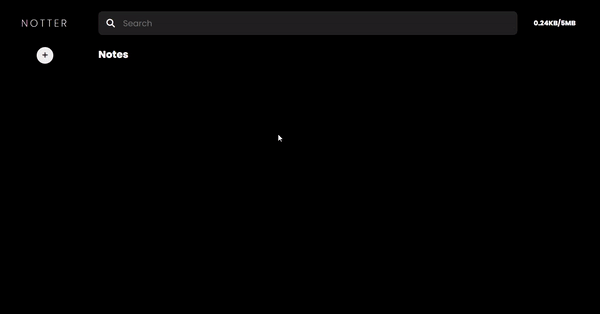

# [Notter - The Notes Taking App](https://devanupshourya.github.io/Notter-App/)


Made by HTML , SCSS and TS. 

#### For SCSS Compilation 
```bash
  sass --watch src/scss/:dist/css/
```

## Contact Me
 - [E-Mail](mailto:contact.yourwebdev@gmail.com)
 - [Github](https://github.com/AnupShouryaDev)
 - [LinkedIn](https://www.linkedin.com/in/anup-shourya-141b3b1b5/)

## Future RoadMap
- Add a feature : when there is no notes to display then show it to user like 'No Notes to display' or any Animation.
- Add Responsiveness.
- Show Current Date and Time both in Time showing div.
- Add Some Animation on clicking the + icon.
- Make the code more readable.
